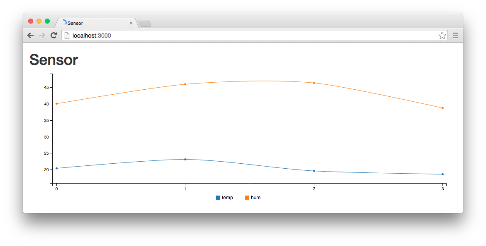

## Sensor visualization

A simple web app to plot sensor data. Based on Ruby on Rails and C3.js.



To get the server running:

```
rails s
```

To post some data using curl:

```
curl -X POST -H "Content-Type: application/json" \
-d '{"temperatura": 18.6, "humedad":38.7}' \
http://localhost:3000/api/sensor/create
```

or with wget (easier for Intel Galileo):

```
wget -O- --post-data='{"temperatura": 18.6, "humedad":38.7}' \
--header=Content-Type:application/json \
http://localhost:3000/api/sensor/create
```
